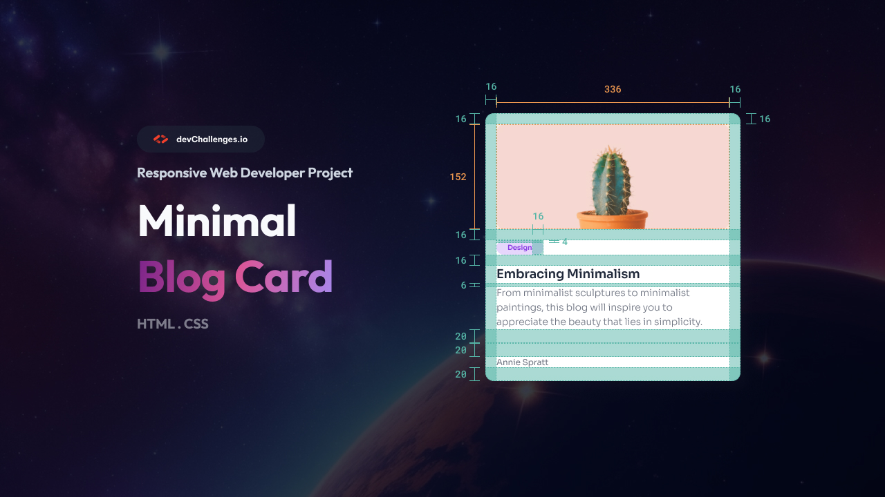

# DevChallenges.io - Cartão de Blog Minimalista

## Bem-vindo! 👋

Este projeto é feito com base no desafio encontrado no site [devChallenges.io](https://devchallenges.io/). São projetos para ajudar você a aprimorar suas habilidades de codificação criando projetos realistas.

**Habilidades sugeridas para praticar: HTML e CSS**

## O desafio

Sua tarefa é criar uma página web que se assemelhe ao design fornecido.

## Visualização 
Acesse o resultado final do desafio clicando em [Visualização Cartão de Blog Minimalista](https://dev-challenges-pagina-de-perguntas.vercel.app)

## Tecnologias Usadas
- Html
- Css

